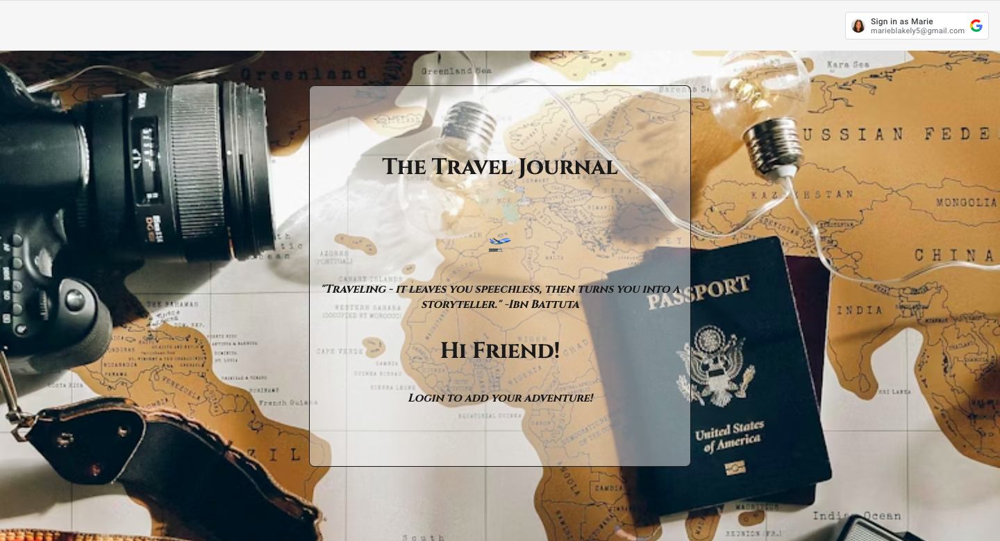

# The Travel Journal

## Explore The Travel Journal here:

### [The Travel Journal](https://the-travel-journal.fly.dev)

### Description:

##### Through The Travel Journal you are able to create a post to document the locations you visit and what you enjoyed about your time there. You can upload a photo as well. Users when logged in, are able to comment on your post to share their experiences of that location. You can add as many locations as you like and comment on other users posts as well. 

### Planning Materials:

[Planning Materials](https://trello.com/invite/b/NjFljpz1/ATTI2704ae0e4df224e63a8b977b7d7751c87BCCE9BC/the-travel-journal)

Technologies Used:

* HTML
* JavaScript
* CSS
* Git
* GitHub
* Trello
* Whimsical
* Fly.io
* MongoDB Compass
* Node.js
* Google OAuth

Attributes:
* [Favicon Image](https://www.realsimple.com/thmb/xLA4latZR6rEXcB0S2fYPs7o7ug=/750x0/filters:no_upscale():max_bytes(150000):strip_icc():format(webp)/travel-agent-GettyImages-1211719627-4b924cc562fe4ab4b137b6e4ea9d401d.jpg) 
* [Cinzel Google Font](https://fonts.google.com/selection/embed)
* [Unsplash](https://unsplash.com/photos/flat-lay-photography-of-camera-book-and-bag-qyAka7W5uMY)
* [Animate.css](https://animate.style/)

Icebox Items:
* AAU I want to be able to add a site or restaurant I visited while at the location I traveled to.

